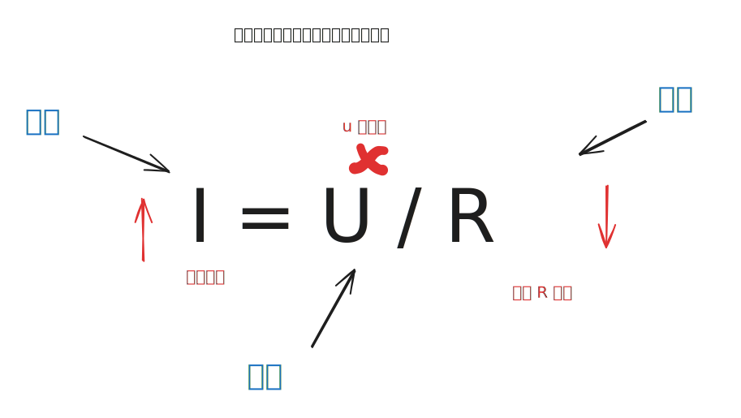

# GPIO控制

每一个GPIO引脚都代表了单片机可以通过这个引脚<mark style="color:blue;">**输出一个高/低电平**</mark>，或者<mark style="color:blue;">**读取一个外部电平**</mark>，而<mark style="color:blue;">**不同的GPIO**</mark>又被赋予了<mark style="color:blue;">**其他不同的附加功能**</mark>，在此章，我们只需要关注<mark style="color:blue;">**GPIO引脚能输出一个高/低电平**</mark>。


## 一、硬件连接

<figure><figcaption></figcaption></figure>

这个硬件其实就没什么好解释了，需要点亮一个灯的话，就必须<mark style="color:blue;">连接一个正极，一个负极</mark>，上述我们已经提到：<mark style="color:blue;">GPIO可以输出高/低电平</mark>，此时将LED小灯的<mark style="color:blue;">负极固定接地（GND）</mark>，如果<mark style="color:blue;">GPIO输出高电平，此时就会产生电流，点亮LED小灯</mark>，如果<mark style="color:blue;">GPIO输出低电平，此时两端GPIO18和GND电压一样，就不会产生电流，小灯就不会亮</mark>

<mark style="color:blue;">附加解释：在电路中，最重要的3个因素就是：电压，电流，电阻。</mark>

<mark style="color:red;">**什么是电压和电流？**</mark>\
<mark style="color:blue;">电压可以理解为一个大水库</mark>，<mark style="color:blue;">电流可以理解为水库内的水</mark>。那<mark style="color:blue;">用电器</mark>呢（也就是我们这里的LED小灯，也可以是其他用电的设备）<mark style="color:blue;">就是在水库里面的一个水车</mark>，如果我们想要这个水车能被水流冲击动起来，那这个水是不是要有一个高低差，<mark style="color:blue;">有高低差才能水流</mark>，对应到电流上就是，<mark style="color:blue;">电压有高低，才能形成电流的流动</mark>


<mark style="color:red;">**注意：这里的高低电位差是一个相对概念，只是谁相对于谁而言，0v一定是低电位吗？不是的！它比-1V高，220V一定是高电位吗？不是的他比330V低**</mark>


<mark style="color:red;">**那什么是电阻呢？**</mark>

电阻的理解也可以结合上面的，电阻可以先简单的理解为：<mark style="color:blue;">**对电流的阻碍**</mark>。就像上面说的，有水位差才能带动风车转起来，但是如果<mark style="color:blue;">**水位差太大了，水流太急太猛了就容易给风车转冒烟**</mark>，那为了风车安全，就<mark style="color:blue;">**在风车前做一个类似于电阻的东西，让他先缓冲一下水（缓冲级）**</mark>，让水不要那么急，在电路中，电阻也是做这个作用，如果电压过大容易把用电器烧掉，<mark style="color:blue;">**电阻可以理解为缓冲电压，减小电流**</mark>




## 二、代码编写

<mark style="color:orange;">Micropython</mark>对此部分的说明：[https://docs.micropython.org/en/latest/esp32/quickref.html#pins-and-gpio](https://docs.micropython.org/en/latest/esp32/quickref.html#pins-and-gpio)

```python
# 第一步就是导包，导入相关的函数
from machine import Pin  # 还是挺好记的，从机器内导入一个Pin的包，Pin就是引脚的意思
import time # 时间相关的包，这个同python用法差不多

if __name__ =='__main__': # 程序入口。主要是为了后面多线程编程，平时也应注意配置入口函数。
    
    # 如果要操作一个引脚，肯定是要创建一个实例化对象，对实例化对象进行操作（这部分是python基础）
    # 第一个是设置这个引脚对应开发板的是那个GPIO脚，第二个参数设置这个引脚做输出还是做输入
    PIN3 = Pin(18,Pin.OUT) # 我接在了GPIO18上，因为要控制灯，我配置成输出引脚
    
    # 这里实现一个间隔 1s 灯亮一次
    while 1:
        PIN3.on() # on打开的意思嘛，就是让这个引脚打开成高电平
        time.sleep(1) # 延时
        PIN3.off() # 同理
        time.sleep(1) # 延时
        

# 这里设置成 while，就是让这个代码一直执行而不是闪一下就不整了
```

## 烧录（下载）到设备

<figure><figcaption></figcaption></figure>

<figure><figcaption></figcaption></figure>

<figure><figcaption></figcaption></figure>

<figure><figcaption></figcaption></figure>

<mark style="color:red;">**想要结束或者修改了代码想要保存的时候，都应该先停止设备，然后再进行操作，不然设备会一直处于运行占用状态，没空理会你的操作请求！**</mark>


## 三、自主学习

学习单片机来说，点亮LED灯可以说是硬件开发届的 Hello world，上述也已经实现了点亮LED小灯的过程。

### 设计要求：<mark style="color:blue;">**跑马灯**</mark>

**以下为效果演示**

<figure><figcaption></figcaption></figure>

### 参考代码

{% embed url="https://github.com/Aqiuseven/WuLianWang/blob/main/%E5%8D%95%E7%89%87%E6%9C%BA%E5%9F%BA%E7%A1%80/IO%E6%8E%A7%E5%88%B6/LiuShui.py" %}
