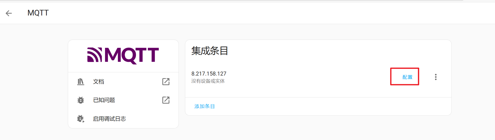

# 软件环境搭建

## 一、ESP32 开发环境的搭建

【:exclamation:使用的 <mark style="color:blue;">ESP32</mark> 开发语言并非传统硬件开发语言 <mark style="color:orange;">C</mark>，而是使用 <mark style="color:orange;">Micropython</mark>

:exclamation: 另外我并不觉得哪个开发工具比哪个开发工具好，适合自己的工具就是最好的 :exclamation:】&#x20;

* ### 1 . 下载 <mark style="color:purple;">Thonny</mark>
  * <mark style="color:red;">值得注意的是：</mark><mark style="color:red;">**新版本的**</mark>**Thonny** **不需要提前下载固件**，可以在烧录时自动下载，但是由于是下载github内的内容，国内下载可能会失败\

  * <mark style="color:purple;">Thonny</mark> 下载地址： [https://github.com/thonny/thonny/releases](https://github.com/thonny/thonny/releases)\

* ### 2 . 下载相关固件
  * <mark style="color:orange;">micropython</mark> ：[https://micropython.org/download/](https://micropython.org/download/)
  * <mark style="color:blue;">ESP32 WROOM</mark>：[https://micropython.org/download/ESP32\_GENERIC/](https://micropython.org/download/ESP32_GENERIC/)\
    \
    :exclamation::exclamation:注意第二个固件要和自己手上的板子对于，因为我手上的<mark style="color:blue;">ESP32 WROOM</mark>所以我下载的是这个:exclamation::exclamation:\

* ### 3 . 烧录固件
  *   <mark style="color:red;">连接ESP32前需要安装USB驱动 ：</mark>[<mark style="color:red;">https://wwli.lanzoue.com/iJigw2fctv6b</mark>](https://wwli.lanzoue.com/iJigw2fctv6b)\

      <figure><figcaption></figcaption></figure>

      <figure><figcaption></figcaption></figure>

      <figure><figcaption></figcaption></figure>

      \
      以下为<mark style="color:red;">**在线安装**</mark>：\

      <figure><figcaption></figcaption></figure>

      \
      以下为<mark style="color:red;">**本地固件烧录：**</mark>\

      <figure><figcaption></figcaption></figure>

      <mark style="color:red;">**烧录成功**</mark>\

      <figure><figcaption></figcaption></figure>

* ### 4.连接设备
  *

      <figure><figcaption></figcaption></figure>

      <figure><figcaption></figcaption></figure>

## 二、EMQX和HomeAsstant 配置

*   ### 1.安装

    
<figure><figcaption></figcaption></figure>

    安装好 <mark style="color:purple;">EMQX</mark> 和  <mark style="color:purple;">Homeassistant</mark> 之后 打开配置即可，默认不绑定域名的话都是以 <mark style="color:green;">IP:端口</mark> 的形式访问的。\
    <mark style="color:red;">备注：宝塔docker安装的EMQX默认账号密码是：</mark><mark style="color:red;">**admin/public，**</mark><mark style="color:red;">第一次登录后会要求你更新密码</mark>\
    \
    <mark style="color:red;background-color:red;">**！！！注意注意！！！ ： 如果你的宝塔Docker配置了阿里云镜像的话，拉取的**</mark><mark style="color:red;background-color:red;">Homeassistant</mark> <mark style="color:red;background-color:red;"></mark><mark style="color:red;background-color:red;">**版本会一直是21年的版本。**</mark>\ <mark style="color:red;background-color:red;">**解决办法一 ： 不使用加速镜像**</mark>\ <mark style="color:red;background-color:red;">**解决办法二 ： 使用**</mark> [<mark style="color:red;background-color:red;">**https://docker.1panel.dev**</mark>](https://docker.1panel.dev) <mark style="color:red;background-color:red;">**这个镜像**</mark>\ <mark style="color:red;background-color:red;">**具体使用什么版本看你自己喜欢，新版本也不一定好用，但是可以体验一些新的功能和新特性**</mark>\

*   ### 2.在 <mark style="color:purple;">HomeAssistant</mark> 中添加 <mark style="color:purple;">EMQX</mark>

    <figure><figcaption></figcaption></figure>

    <figure><figcaption></figcaption></figure>

    <figure><figcaption></figcaption></figure>

    <figure><figcaption></figcaption></figure>

    成功后会有如下提示：\

    <figure><figcaption></figcaption></figure>
*   ### 3.测试MQTT服务

    在 <mark style="background-color:yellow;">**HomeAssistant**</mark> -> <mark style="background-color:yellow;">**设备与服务**</mark> -> <mark style="background-color:yellow;">**集成**</mark> -> <mark style="background-color:yellow;">**MQTT**</mark>\

    <figure><figcaption></figcaption></figure>

    <figure><figcaption></figcaption></figure>

    <figure><figcaption>
成功示例
</figcaption></figure>

## 三、配置嵌入式开发环境

这里配置有点麻烦，所以直接使用一个配置好的Ubuntu镜像，节约时间节约生命\
\
配置完成的Ubuntu镜像可以用这个：\
[https://pan.baidu.com/s/19t8AZV9SYTdjn2uObBiSGA](https://pan.baidu.com/s/19t8AZV9SYTdjn2uObBiSGA)   提取码：hslu\
虚拟机位置 <mark style="background-color:yellow;">全部文件</mark> -> <mark style="background-color:yellow;">鲁班猫\_瑞芯微系...</mark> -> <mark style="background-color:yellow;">8-SDK源码压...</mark> -> <mark style="background-color:yellow;">开发环境虚拟机</mark>\
我是用的是 ： **ubuntu20.04\_lite.7z** 版本，因为在编写这篇笔记时，我也是初学，更在意如果使用。\
\
<mark style="color:green;">（一建议：学习一个新的技术或者一个新的知识，应该先学会怎么用，在研究为什么。而不是一开始就苦钻原理让自己失去学习的兴趣和动力）</mark>\
\
完整配置过程可以参考这个：[https://doc.embedfire.com/linux/qt/embed/zh/latest/ebf\_qt/install/introduc.html](https://doc.embedfire.com/linux/qt/embed/zh/latest/ebf_qt/install/introduc.html)\
\
\
项目编译可以参考这个：\
[https://doc.embedfire.com/linux/qt/embed/zh/latest/ebf\_qt/qtdemo/demo\_compile.html](https://doc.embedfire.com/linux/qt/embed/zh/latest/ebf_qt/qtdemo/demo_compile.html)

至此软件环境搭建部分写完了。
